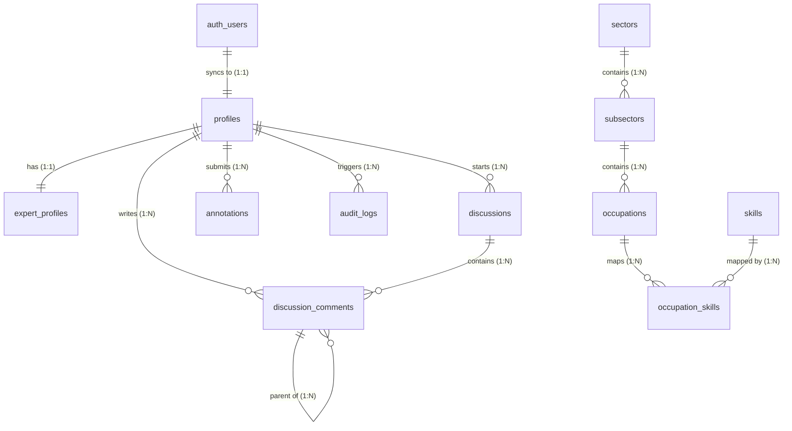

# Database Schema (Supabase / PostgreSQL)

This document defines the relational database schema for the **Skills Mapping Platform**, targetting **Supabase (PostgreSQL)**. 

The schema supports core operations including User Profiles, Expert Credentials Verification, Sectors/Subsectors/Occupations taxonomies, Collaborative Discussions, Expert Annotations (Suggestions), and Admin Audit Logging.

---

## 1. Entity-Relationship Diagram (ERD)



---

## 2. Table Catalog

### `profiles`
Holds basic profile information for all users. Synchronized automatically with Supabase's `auth.users` table.
* **id**: `UUID` (Primary Key, foreign key to `auth.users`)
* **email**: `TEXT` (Not Null)
* **full_name**: `TEXT`
* **avatar_url**: `TEXT`
* **role**: `user_role` enum (`general_user`, `expert_user`, `admin_user`)
* **created_at**: `TIMESTAMPTZ` (Default: `now()`)
* **updated_at**: `TIMESTAMPTZ` (Default: `now()`)

### `expert_profiles`
Holds application credentials and validation details for experts.
* **profile_id**: `UUID` (Primary Key, foreign key to `profiles.id`)
* **organization**: `TEXT`
* **phone_number**: `TEXT`
* **country_citizenship**: `TEXT`
* **country_residence**: `TEXT`
* **city**: `TEXT`
* **cv_url**: `TEXT` (URL to file in Supabase Storage)
* **linkedin_url**: `TEXT`
* **github_url**: `TEXT`
* **orcid_id**: `TEXT`
* **google_scholar_id**: `TEXT`
* **scopus_id**: `TEXT`
* **portfolio_url**: `TEXT`
* **employment_history**: `JSONB` (Array of historic roles)
* **academic_qualifications**: `JSONB` (Array of degrees/certificates)
* **status**: `expert_status` enum (`pending`, `approved`, `rejected`)
* **approved_by**: `UUID` (Foreign key to `profiles.id`)
* **approved_at**: `TIMESTAMPTZ`
* **rejection_reason**: `TEXT`
* **created_at**: `TIMESTAMPTZ` (Default: `now()`)
* **updated_at**: `TIMESTAMPTZ` (Default: `now()`)

### `sectors`
Top-level economic/manufacturing sectors.
* **id**: `UUID` (Primary Key, Default: `gen_random_uuid()`)
* **name**: `TEXT` (Unique, Not Null)
* **description**: `TEXT`
* **analytics**: `JSONB` (Dynamic analytics and statistics)
* **created_at**: `TIMESTAMPTZ` (Default: `now()`)
* **updated_at**: `TIMESTAMPTZ` (Default: `now()`)

### `subsectors`
Subsectors belonging to a sector.
* **id**: `UUID` (Primary Key, Default: `gen_random_uuid()`)
* **sector_id**: `UUID` (Foreign key to `sectors.id`)
* **name**: `TEXT` (Not Null)
* **description**: `TEXT`
* **analytics**: `JSONB`
* **created_at**: `TIMESTAMPTZ` (Default: `now()`)
* **updated_at**: `TIMESTAMPTZ` (Default: `now()`)

### `occupations`
Standardized occupations within subsectors, utilizing OFO codes where applicable.
* **id**: `UUID` (Primary Key, Default: `gen_random_uuid()`)
* **subsector_id**: `UUID` (Foreign key to `subsectors.id`)
* **ofo_code**: `TEXT` (South African Organizing Framework for Occupations code)
* **title**: `TEXT` (Not Null)
* **description**: `TEXT` (Not Null)
* **tasks**: `JSONB` (List of standard tasks)
* **requirements**: `TEXT`
* **education_pathway**: `TEXT`
* **labour_market_analytics**: `JSONB`
* **created_at**: `TIMESTAMPTZ` (Default: `now()`)
* **updated_at**: `TIMESTAMPTZ` (Default: `now()`)

### `skills`
Relational reference copy of skills mapped in the graph DB.
* **id**: `UUID` (Primary Key, Default: `gen_random_uuid()`)
* **name**: `TEXT` (Unique, Not Null)
* **description**: `TEXT` (Not Null)
* **type**: `TEXT` (e.g., 'hard', 'soft', 'cross-cutting')
* **level**: `TEXT` (e.g., 'entry', 'intermediate', 'advanced')
* **status**: `TEXT` (Default: 'active')
* **created_at**: `TIMESTAMPTZ` (Default: `now()`)
* **updated_at**: `TIMESTAMPTZ` (Default: `now()`)

### `occupation_skills`
Relational link table mapping occupations to skills.
* **id**: `UUID` (Primary Key, Default: `gen_random_uuid()`)
* **occupation_id**: `UUID` (Foreign key to `occupations.id`)
* **skill_id**: `UUID` (Foreign key to `skills.id`)
* **relation_type**: `TEXT` (Default: 'required')
* **created_at**: `TIMESTAMPTZ` (Default: `now()`)

### `discussions`
Collaboration spaces for expert users to discuss changes and consensus.
* **id**: `UUID` (Primary Key, Default: `gen_random_uuid()`)
* **title**: `TEXT` (Not Null)
* **description**: `TEXT` (Not Null)
* **category**: `TEXT` (Not Null, e.g., 'general', 'content_dispute', 'consensus_check')
* **entity_type**: `TEXT` (e.g., 'occupation', 'skill', 'sector')
* **entity_id**: `UUID`
* **created_by**: `UUID` (Foreign key to `profiles.id`)
* **status**: `discussion_status` enum (`open`, `resolved`, `disputed`)
* **created_at**: `TIMESTAMPTZ` (Default: `now()`)
* **updated_at**: `TIMESTAMPTZ` (Default: `now()`)

### `discussion_comments`
Threaded replies within discussions.
* **id**: `UUID` (Primary Key, Default: `gen_random_uuid()`)
* **discussion_id**: `UUID` (Foreign key to `discussions.id`)
* **user_id**: `UUID` (Foreign key to `profiles.id`)
* **parent_id**: `UUID` (Self-referencing for nesting replies)
* **content**: `TEXT` (Not Null)
* **created_at**: `TIMESTAMPTZ` (Default: `now()`)
* **updated_at**: `TIMESTAMPTZ` (Default: `now()`)

### `annotations`
Proposed changes or edits on primary platform data entities.
* **id**: `UUID` (Primary Key, Default: `gen_random_uuid()`)
* **user_id**: `UUID` (Foreign key to `profiles.id`)
* **entity_type**: `TEXT` (e.g., 'occupation', 'skill')
* **entity_id**: `UUID` (Not Null)
* **field_name**: `TEXT` (Name of the updated attribute)
* **original_value**: `TEXT`
* **suggested_value**: `TEXT` (Not Null)
* **comments**: `TEXT`
* **status**: `annotation_status` enum (`pending`, `consensus_reached`, `applied`, `rejected`)
* **resolved_by**: `UUID` (Foreign key to `profiles.id`)
* **resolved_at**: `TIMESTAMPTZ`
* **created_at**: `TIMESTAMPTZ` (Default: `now()`)
* **updated_at**: `TIMESTAMPTZ` (Default: `now()`)

### `audit_logs`
System administrative event logs.
* **id**: `UUID` (Primary Key, Default: `gen_random_uuid()`)
* **user_id**: `UUID` (Foreign key to `profiles.id`)
* **action**: `TEXT` (Not Null, e.g., 'approve_expert', 'delete_comment')
* **entity_type**: `TEXT`
* **entity_id**: `UUID`
* **changes**: `JSONB` (Snapshot of differences)
* **ip_address**: `TEXT`
* **created_at**: `TIMESTAMPTZ` (Default: `now()`)

---

## 3. SQL Definition Script

Copy and run the following script in your Supabase SQL Editor.

```sql
-- Enable UUID generator extension
CREATE EXTENSION IF NOT EXISTS "uuid-ossp";

-- =========================================================================
-- CUSTOM ENUM TYPES
-- =========================================================================
CREATE TYPE user_role AS ENUM ('general_user', 'expert_user', 'admin_user');
CREATE TYPE expert_status AS ENUM ('pending', 'approved', 'rejected');
CREATE TYPE discussion_status AS ENUM ('open', 'resolved', 'disputed');
CREATE TYPE annotation_status AS ENUM ('pending', 'consensus_reached', 'applied', 'rejected');

-- =========================================================================
-- TABLES
-- =========================================================================

-- 1. Profiles (linked 1:1 to auth.users)
CREATE TABLE public.profiles (
    id UUID PRIMARY KEY REFERENCES auth.users ON DELETE CASCADE,
    email TEXT NOT NULL,
    full_name TEXT,
    avatar_url TEXT,
    role user_role NOT NULL DEFAULT 'general_user',
    created_at TIMESTAMPTZ NOT NULL DEFAULT timezone('utc'::text, now()),
    updated_at TIMESTAMPTZ NOT NULL DEFAULT timezone('utc'::text, now())
);

-- 2. Expert Profiles
CREATE TABLE public.expert_profiles (
    profile_id UUID PRIMARY KEY REFERENCES public.profiles(id) ON DELETE CASCADE,
    organization TEXT,
    phone_number TEXT,
    country_citizenship TEXT,
    country_residence TEXT,
    city TEXT,
    cv_url TEXT,
    linkedin_url TEXT,
    github_url TEXT,
    orcid_id TEXT,
    google_scholar_id TEXT,
    scopus_id TEXT,
    portfolio_url TEXT,
    employment_history JSONB DEFAULT '[]'::jsonb,
    academic_qualifications JSONB DEFAULT '[]'::jsonb,
    status expert_status NOT NULL DEFAULT 'pending',
    approved_by UUID REFERENCES public.profiles(id) ON DELETE SET NULL,
    approved_at TIMESTAMPTZ,
    rejection_reason TEXT,
    created_at TIMESTAMPTZ NOT NULL DEFAULT timezone('utc'::text, now()),
    updated_at TIMESTAMPTZ NOT NULL DEFAULT timezone('utc'::text, now())
);

-- 3. Sectors
CREATE TABLE public.sectors (
    id UUID PRIMARY KEY DEFAULT gen_random_uuid(),
    name TEXT NOT NULL UNIQUE,
    description TEXT,
    analytics JSONB DEFAULT '{}'::jsonb,
    created_at TIMESTAMPTZ NOT NULL DEFAULT timezone('utc'::text, now()),
    updated_at TIMESTAMPTZ NOT NULL DEFAULT timezone('utc'::text, now())
);

-- 4. Subsectors
CREATE TABLE public.subsectors (
    id UUID PRIMARY KEY DEFAULT gen_random_uuid(),
    sector_id UUID NOT NULL REFERENCES public.sectors(id) ON DELETE CASCADE,
    name TEXT NOT NULL,
    description TEXT,
    analytics JSONB DEFAULT '{}'::jsonb,
    created_at TIMESTAMPTZ NOT NULL DEFAULT timezone('utc'::text, now()),
    updated_at TIMESTAMPTZ NOT NULL DEFAULT timezone('utc'::text, now()),
    CONSTRAINT unique_subsector_name_per_sector UNIQUE (sector_id, name)
);

-- 5. Occupations
CREATE TABLE public.occupations (
    id UUID PRIMARY KEY DEFAULT gen_random_uuid(),
    subsector_id UUID NOT NULL REFERENCES public.subsectors(id) ON DELETE CASCADE,
    ofo_code TEXT,
    title TEXT NOT NULL,
    description TEXT NOT NULL,
    tasks JSONB DEFAULT '[]'::jsonb,
    requirements TEXT,
    education_pathway TEXT,
    labour_market_analytics JSONB DEFAULT '{}'::jsonb,
    created_at TIMESTAMPTZ NOT NULL DEFAULT timezone('utc'::text, now()),
    updated_at TIMESTAMPTZ NOT NULL DEFAULT timezone('utc'::text, now()),
    CONSTRAINT unique_occupation_title_per_subsector UNIQUE (subsector_id, title)
);

-- 6. Skills (Relational Index)
CREATE TABLE public.skills (
    id UUID PRIMARY KEY DEFAULT gen_random_uuid(),
    name TEXT NOT NULL UNIQUE,
    description TEXT NOT NULL,
    type TEXT,
    level TEXT,
    status TEXT NOT NULL DEFAULT 'active',
    created_at TIMESTAMPTZ NOT NULL DEFAULT timezone('utc'::text, now()),
    updated_at TIMESTAMPTZ NOT NULL DEFAULT timezone('utc'::text, now())
);

-- 7. Occupation-Skill Mappings
CREATE TABLE public.occupation_skills (
    id UUID PRIMARY KEY DEFAULT gen_random_uuid(),
    occupation_id UUID NOT NULL REFERENCES public.occupations(id) ON DELETE CASCADE,
    skill_id UUID NOT NULL REFERENCES public.skills(id) ON DELETE CASCADE,
    relation_type TEXT NOT NULL DEFAULT 'required',
    created_at TIMESTAMPTZ NOT NULL DEFAULT timezone('utc'::text, now()),
    CONSTRAINT unique_occupation_skill UNIQUE (occupation_id, skill_id)
);

-- 8. Discussions
CREATE TABLE public.discussions (
    id UUID PRIMARY KEY DEFAULT gen_random_uuid(),
    title TEXT NOT NULL,
    description TEXT NOT NULL,
    category TEXT NOT NULL,
    entity_type TEXT,
    entity_id UUID,
    created_by UUID NOT NULL REFERENCES public.profiles(id) ON DELETE CASCADE,
    status discussion_status NOT NULL DEFAULT 'open',
    created_at TIMESTAMPTZ NOT NULL DEFAULT timezone('utc'::text, now()),
    updated_at TIMESTAMPTZ NOT NULL DEFAULT timezone('utc'::text, now())
);

-- 9. Discussion Comments
CREATE TABLE public.discussion_comments (
    id UUID PRIMARY KEY DEFAULT gen_random_uuid(),
    discussion_id UUID NOT NULL REFERENCES public.discussions(id) ON DELETE CASCADE,
    user_id UUID NOT NULL REFERENCES public.profiles(id) ON DELETE CASCADE,
    parent_id UUID REFERENCES public.discussion_comments(id) ON DELETE CASCADE,
    content TEXT NOT NULL,
    created_at TIMESTAMPTZ NOT NULL DEFAULT timezone('utc'::text, now()),
    updated_at TIMESTAMPTZ NOT NULL DEFAULT timezone('utc'::text, now())
);

-- 10. Annotations (Suggested Edits)
CREATE TABLE public.annotations (
    id UUID PRIMARY KEY DEFAULT gen_random_uuid(),
    user_id UUID NOT NULL REFERENCES public.profiles(id) ON DELETE CASCADE,
    entity_type TEXT NOT NULL,
    entity_id UUID NOT NULL,
    field_name TEXT NOT NULL,
    original_value TEXT,
    suggested_value TEXT NOT NULL,
    comments TEXT,
    status annotation_status NOT NULL DEFAULT 'pending',
    resolved_by UUID REFERENCES public.profiles(id) ON DELETE SET NULL,
    resolved_at TIMESTAMPTZ,
    created_at TIMESTAMPTZ NOT NULL DEFAULT timezone('utc'::text, now()),
    updated_at TIMESTAMPTZ NOT NULL DEFAULT timezone('utc'::text, now())
);

-- 11. Audit Logs
CREATE TABLE public.audit_logs (
    id UUID PRIMARY KEY DEFAULT gen_random_uuid(),
    user_id UUID REFERENCES public.profiles(id) ON DELETE SET NULL,
    action TEXT NOT NULL,
    entity_type TEXT,
    entity_id UUID,
    changes JSONB DEFAULT '{}'::jsonb,
    ip_address TEXT,
    created_at TIMESTAMPTZ NOT NULL DEFAULT timezone('utc'::text, now())
);

-- =========================================================================
-- INDEXES FOR PERFORMANCE
-- =========================================================================
CREATE INDEX idx_subsectors_sector_id ON public.subsectors(sector_id);
CREATE INDEX idx_occupations_subsector_id ON public.occupations(subsector_id);
CREATE INDEX idx_occupation_skills_occ_id ON public.occupation_skills(occupation_id);
CREATE INDEX idx_occupation_skills_skill_id ON public.occupation_skills(skill_id);
CREATE INDEX idx_discussions_entity ON public.discussions(entity_type, entity_id);
CREATE INDEX idx_discussions_created_by ON public.discussions(created_by);
CREATE INDEX idx_comments_discussion_id ON public.discussion_comments(discussion_id);
CREATE INDEX idx_comments_parent_id ON public.discussion_comments(parent_id);
CREATE INDEX idx_annotations_entity ON public.annotations(entity_type, entity_id);
CREATE INDEX idx_annotations_user_id ON public.annotations(user_id);
CREATE INDEX idx_audit_logs_user_id ON public.audit_logs(user_id);

-- =========================================================================
-- AUTOMATED TRIGGERS
-- =========================================================================

-- Trigger function: Update updated_at timestamp automatically
CREATE OR REPLACE FUNCTION public.handle_updated_at()
RETURNS TRIGGER AS $$
BEGIN
    NEW.updated_at = now();
    RETURN NEW;
END;
$$ LANGUAGE plpgsql;

-- Apply timestamp update trigger to tables
CREATE TRIGGER trigger_update_profiles_timestamp BEFORE UPDATE ON public.profiles FOR EACH ROW EXECUTE FUNCTION public.handle_updated_at();
CREATE TRIGGER trigger_update_expert_profiles_timestamp BEFORE UPDATE ON public.expert_profiles FOR EACH ROW EXECUTE FUNCTION public.handle_updated_at();
CREATE TRIGGER trigger_update_sectors_timestamp BEFORE UPDATE ON public.sectors FOR EACH ROW EXECUTE FUNCTION public.handle_updated_at();
CREATE TRIGGER trigger_update_subsectors_timestamp BEFORE UPDATE ON public.subsectors FOR EACH ROW EXECUTE FUNCTION public.handle_updated_at();
CREATE TRIGGER trigger_update_occupations_timestamp BEFORE UPDATE ON public.occupations FOR EACH ROW EXECUTE FUNCTION public.handle_updated_at();
CREATE TRIGGER trigger_update_skills_timestamp BEFORE UPDATE ON public.skills FOR EACH ROW EXECUTE FUNCTION public.handle_updated_at();
CREATE TRIGGER trigger_update_discussions_timestamp BEFORE UPDATE ON public.discussions FOR EACH ROW EXECUTE FUNCTION public.handle_updated_at();
CREATE TRIGGER trigger_update_discussion_comments_timestamp BEFORE UPDATE ON public.discussion_comments FOR EACH ROW EXECUTE FUNCTION public.handle_updated_at();
CREATE TRIGGER trigger_update_annotations_timestamp BEFORE UPDATE ON public.annotations FOR EACH ROW EXECUTE FUNCTION public.handle_updated_at();

-- Trigger function: Sync newly registered users from auth.users to public.profiles
CREATE OR REPLACE FUNCTION public.handle_new_user()
RETURNS TRIGGER AS $$
BEGIN
    INSERT INTO public.profiles (id, email, full_name, avatar_url, role)
    VALUES (
        NEW.id,
        NEW.email,
        COALESCE(NEW.raw_user_meta_data->>'full_name', ''),
        COALESCE(NEW.raw_user_meta_data->>'avatar_url', ''),
        'general_user'
    );
    RETURN NEW;
END;
$$ LANGUAGE plpgsql SECURITY DEFINER;

-- Trigger execution: Sync on insert into auth.users
CREATE TRIGGER on_auth_user_created
    AFTER INSERT ON auth.users
    FOR EACH ROW EXECUTE FUNCTION public.handle_new_user();
```

---

## 4. Row Level Security (RLS) Policies

Supabase secures database access using PostgreSQL Row Level Security. Below are the RLS configurations recommended for this platform.

### Enabling RLS
Enable RLS on all public tables:
```sql
ALTER TABLE public.profiles ENABLE ROW LEVEL SECURITY;
ALTER TABLE public.expert_profiles ENABLE ROW LEVEL SECURITY;
ALTER TABLE public.sectors ENABLE ROW LEVEL SECURITY;
ALTER TABLE public.subsectors ENABLE ROW LEVEL SECURITY;
ALTER TABLE public.occupations ENABLE ROW LEVEL SECURITY;
ALTER TABLE public.skills ENABLE ROW LEVEL SECURITY;
ALTER TABLE public.occupation_skills ENABLE ROW LEVEL SECURITY;
ALTER TABLE public.discussions ENABLE ROW LEVEL SECURITY;
ALTER TABLE public.discussion_comments ENABLE ROW LEVEL SECURITY;
ALTER TABLE public.annotations ENABLE ROW LEVEL SECURITY;
ALTER TABLE public.audit_logs ENABLE ROW LEVEL SECURITY;
```

### Profile Policies
* **Read Profiles**: Anyone can view profiles (needed for showing usernames/avatars next to comments).
* **Write Profiles**: Users can only update their own profile data.
```sql
CREATE POLICY "Public profiles are viewable by everyone" ON public.profiles
    FOR SELECT USING (true);

CREATE POLICY "Users can update their own profile" ON public.profiles
    FOR UPDATE USING (auth.uid() = id);
```

### Expert Profile Policies
* **Read Expert Profiles**: Active profiles are public, pending/rejected ones are restricted to admins and the owners.
* **Write Expert Profiles**: Users can create their own application profiles. Only admins can edit status (approved/rejected).
```sql
CREATE POLICY "Approved expert profiles are public" ON public.expert_profiles
    FOR SELECT USING (status = 'approved' OR auth.uid() = profile_id OR EXISTS (
        SELECT 1 FROM public.profiles WHERE id = auth.uid() AND role = 'admin_user'
    ));

CREATE POLICY "Users can insert their own expert profile" ON public.expert_profiles
    FOR INSERT WITH CHECK (auth.uid() = profile_id);

CREATE POLICY "Users can update their own expert profile credentials if pending" ON public.expert_profiles
    FOR UPDATE USING (auth.uid() = profile_id AND status = 'pending')
    WITH CHECK (auth.uid() = profile_id AND status = 'pending');

CREATE POLICY "Admins can manage all expert profiles" ON public.expert_profiles
    FOR ALL USING (EXISTS (
        SELECT 1 FROM public.profiles WHERE id = auth.uid() AND role = 'admin_user'
    ));
```

### Core Taxonomies (Sectors, Subsectors, Occupations, Skills, Mappings)
* **Read**: Readable by all users (authenticated and unauthenticated).
* **Write**: Direct writes are only allowed by admin users. Experts modify this content indirectly through annotations.
```sql
-- Example for Occupations (Apply similar policies to sectors, subsectors, skills, occupation_skills)
CREATE POLICY "Occupations are readable by everyone" ON public.occupations
    FOR SELECT USING (true);

CREATE POLICY "Only admins can insert occupations" ON public.occupations
    FOR INSERT WITH CHECK (EXISTS (
        SELECT 1 FROM public.profiles WHERE id = auth.uid() AND role = 'admin_user'
    ));

CREATE POLICY "Only admins can update occupations" ON public.occupations
    FOR UPDATE USING (EXISTS (
        SELECT 1 FROM public.profiles WHERE id = auth.uid() AND role = 'admin_user'
    ));

CREATE POLICY "Only admins can delete occupations" ON public.occupations
    FOR DELETE USING (EXISTS (
        SELECT 1 FROM public.profiles WHERE id = auth.uid() AND role = 'admin_user'
    ));
```

### Discussion Policies
* **Read Discussions**: Readable by anyone.
* **Write Discussions**: Any logged-in expert or admin can post a discussion or leave a comment.
```sql
CREATE POLICY "Discussions are readable by everyone" ON public.discussions
    FOR SELECT USING (true);

CREATE POLICY "Experts and admins can create discussions" ON public.discussions
    FOR INSERT WITH CHECK (EXISTS (
        SELECT 1 FROM public.profiles WHERE id = auth.uid() AND role IN ('expert_user', 'admin_user')
    ));

CREATE POLICY "Owners can update their own discussions" ON public.discussions
    FOR UPDATE USING (auth.uid() = created_by);
```

### Discussion Comments Policies
* **Read Comments**: Readable by everyone.
* **Write Comments**: Only experts or admins can post. Users can update/delete their own comments.
```sql
CREATE POLICY "Comments are readable by everyone" ON public.discussion_comments
    FOR SELECT USING (true);

CREATE POLICY "Experts and admins can post comments" ON public.discussion_comments
    FOR INSERT WITH CHECK (auth.uid() = user_id AND EXISTS (
        SELECT 1 FROM public.profiles WHERE id = auth.uid() AND role IN ('expert_user', 'admin_user')
    ));

CREATE POLICY "Users can edit/delete their own comments" ON public.discussion_comments
    FOR UPDATE USING (auth.uid() = user_id);

CREATE POLICY "Users can delete their own comments" ON public.discussion_comments
    FOR DELETE USING (auth.uid() = user_id);
```

### Annotations Policies
* **Read Annotations**: Anyone can view suggestions.
* **Create Annotations**: Only verified experts and admins can suggest edits.
* **Resolve Annotations**: Only admins or super experts (managed via specific application authorization logic) can mark annotations as approved/rejected.
```sql
CREATE POLICY "Annotations are viewable by everyone" ON public.annotations
    FOR SELECT USING (true);

CREATE POLICY "Experts and admins can submit annotations" ON public.annotations
    FOR INSERT WITH CHECK (auth.uid() = user_id AND EXISTS (
        SELECT 1 FROM public.profiles WHERE id = auth.uid() AND role IN ('expert_user', 'admin_user')
    ));

CREATE POLICY "Only admins and super experts can resolve annotations" ON public.annotations
    FOR UPDATE USING (EXISTS (
        SELECT 1 FROM public.profiles WHERE id = auth.uid() AND role = 'admin_user'
    ));
```

### Audit Logs Policies
* **Read Logs**: Admin-only.
* **Write Logs**: Writes triggered by database events/server actions. Direct user insertion is blocked.
```sql
CREATE POLICY "Only admins can select audit logs" ON public.audit_logs
    FOR SELECT USING (EXISTS (
        SELECT 1 FROM public.profiles WHERE id = auth.uid() AND role = 'admin_user'
    ));
```
