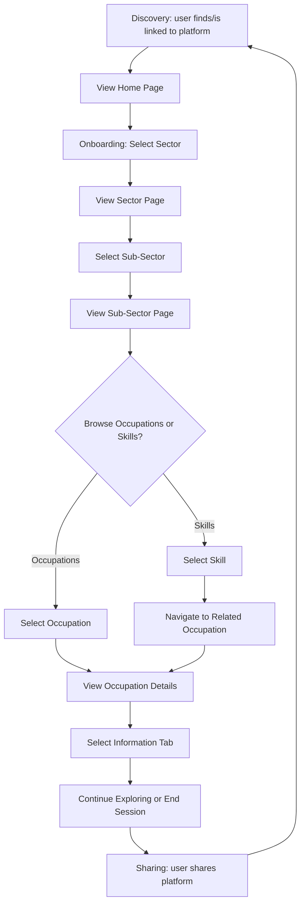

# USER_ROLES.md

## 1. Purpose

This document defines all user roles within the Skills Mapping Platform, including their permissions, responsibilities, workflows, and access restrictions.

It serves as the reference for:

- Backend authorization
- Frontend navigation
- Database permissions
- API access
- Future development

## 2. Role Overview

| Role | Description | Access Level |
|---|---|---|
| **General User** | Read-only access for the general public to search and browse skills and occupations in the mer-sector. | Read-only |
| **Expert User** | Contributes expertise via reviews, edits, and discussions alongside a community of domain experts (industry experts, researchers, policy makers, professional bodies, education providers, merSETA leadership, government administrators, employer bodies). | Read & Conditional Write |
| **Admin User** | Manages the platform, users, and system operations; approves experts, moderates content, oversees system integrity. | Full read, write, moderate |
| **Job Seeker** *(future)* | Uses the platform for career guidance, identifying high-demand roles, and finding learning pathways. | TBD |

---

## General User

A user that has read-only access to the platform. This is any user from the general public who wants to use the platform to find information about skills and occupations in the mer-sector.

### Responsibilities

- Search occupations and skills across all sectors and subsectors.
- Browse sectors and subsectors.
- View sector, subsector, occupation, and skill information.
- Download info ???

### Accessible Pages

- Home page, About page, (other standard pages of a website)
- **Sector Page**
  - Overview
  - Description
  - Sector analytics
  - List of subsectors
  - Occupations within the sector
  - Skills within the sector
- **Subsector Page**
  - Overview
  - Description
  - Subsector analytics
  - Occupations within the subsector
  - Skills within the subsector
- **Occupation Page**
  - Overview
  - Required skills and knowledge
  - Education pathway
  - Labour market analytics
- **Skill Page**
  - Overview
  - Related skills
  - Skill analytics
  - Proficiency framework
  - Upskill roadmap / competency journey
  - Skill status
  - Common/top occupations requiring the skill

### Restrictions

- Can't edit or go into annotation/review mode

### Workflow / User Journey
DISCOVERY
(user searches for / is linked to the platform)
│
▼
Search for Website
│
▼
View Home Page
(user browses available sectors)
│ curiosity turns into trust once the interface feels
│ simple and low-commitment (no forced personal info)
▼
REGISTRATION
(none needed for the general user)
│
▼
ONBOARDING / FIRST USE
│
▼
Select Sector
(e.g. Manufacturing, IT, Healthcare)
│
▼
View Sector Page
│
▼
Select Sub-Sector
│
▼
View Sub-Sector Page
│
▼
DECISION: Browse Occupations or Skills?
│
├── Option A: View All Occupations
│ │
│ ▼
│ Select Occupation
│
└── Option B: View All Skills
│
▼
Select Skill
│
▼
Navigate to Related Occupation
│
│ (both paths converge)
▼
View Occupation Details
(Overview, Skills, Education, Career Path,
Labour Market Trends, Future Outlook, Related Occupations)
│
▼
Select Information Tab
│
▼
View Information for Selected Tab
│
▼
Continue Exploring
(select another tab / another occupation / another
sub-sector or sector) — or End Session
│ success and unlocked value (more learning content,
│ in-demand skills, job opportunities) motivate users
│ to invite others
▼
SHARING
(user shares the platform to unlock more advanced content,
in-demand skills, and job opportunities)
│ shared links become the entry point for new users,
│ restarting the cycle
▼
(loops back to DISCOVERY for new users)

### Authentication

- No authentication required — anonymous/unauthenticated access.
- No account creation, login, or session token needed.

### Authorization

- Permission level: **Read-only**.
- No write, edit, create, delete, or annotation/review permissions on any resource.
- No access to admin, moderation, or content-management endpoints.

### API Access

- Allowed: `GET` requests only, on public endpoints (e.g. `/sectors`, `/subsectors`, `/occupations`, `/skills`, and their nested detail/analytics endpoints).
- Denied: `POST`, `PUT`, `PATCH`, `DELETE` on any endpoint.
- Rate limiting: since this role is unauthenticated, consider IP-based rate limiting to prevent scraping/abuse.

### Database Access

- Effectively no direct database access — this role only interacts with the database indirectly through the backend API layer.
- At the API/service layer: `SELECT`-only queries against public reference data (sectors, subsectors, occupations, skills, and related analytics).
- No access to data involving user accounts, roles, annotations, review workflows, or admin logs.
- No write transactions permitted under this role at any layer.

---

## Expert User

An expert user has more than read-only access to the platform. This user can also contribute to the platform by sharing their expertise and opinion in a community of other experts in the domain.

### Expert users include

- **Industry Experts, Researchers & Policy makers:** Professionals who utilize the platform's analytical insights to study trends, validate findings, and provide expert evidence for policy interventions.
- **Professional Bodies & Certification Partners:** Entities involved in setting standards and certifying competencies, particularly those relevant to specific MER sub-sectors.
- **Education & Training Providers:** TVETs, universities, and private providers who use the platform for curriculum alignment and to ensure training offerings meet current labor market demand.
- **merSETA Leadership & Planning Teams:** Executive members and staff responsible for strategic research and sector skills planning within the MER sector.
- **Government Administrators:** Departments and agencies, such as the Department of Higher Education and Training (DHET), that rely on the data for national-scale strategic planning and institutional mechanism development.
- **Employer & Employer Bodies:** Organizations, particularly in the manufacturing and engineering sectors, that utilize the platform to understand talent pipelines and workforce needs.

### Responsibilities

- All same actions as the general user but with added capabilities.
- Can review, suggest edits, and make edits to information pertaining to skills and occupations.
- Engage in meaningful discussions with other expert users.

### Accessible Pages

- Registration Page
  - Sign up page
- Same pages as general user
- Identity validation page
  - Personal info
  - Professional profile and credentials
  - Review and agreements
- Dashboard
- Expert Network
  - For you
  - Trending
  - Following
  - Consensus Discussions/Files/Threads/Folders
  - Archive
- Review mode of every occupation/skills page

### Restrictions

- Can't access administrator actions.
- Different restrictions for different levels of experts (we will have some hierarchy system — some are "super" expert users, others are not). For example, super expert users have more authority to make final decisions on a consensus reached and can approve/disapprove of certain things.

### Workflow / User Journey
═══════════════════════════════════════════════════════════════
DISCOVERY
"Why do they even start the journey?"
═══════════════════════════════════════════════════════════════
User is a General User who has already browsed the platform
│
▼
Views live demo / preview videos / public skills & occupations taxonomy
│ wants: a centralized place to contribute expertise,
│ collaborate with peers, preview how they'd engage
│ feels: curious, optimistic, a little overwhelmed
▼
Decides platform is worth joining as an Expert

═══════════════════════════════════════════════════════════════
REGISTRATION
"Why would they trust us?"
═══════════════════════════════════════════════════════════════
Click "Sign Up"
│
▼
View Registration Page
(option: LinkedIn / Google / email / institutional or work email)
│
▼
Fill in Details & Click Submit
│
▼
DECISION: Details Valid?
├── No ──► Back to Registration Page (fix & resubmit)
└── Yes ─┐
▼
View "Verify Email" Page → Click Verify Link → Notification: Verified
│ pain: logins/setup that feel tedious
│ want: simple, quick login — one or two pages max
▼
Log In

═══════════════════════════════════════════════════════════════
ONBOARDING & FIRST USE
"How can they feel successful?"
═══════════════════════════════════════════════════════════════
Fill in Expert Credentials
(Google Scholar / ORCID ID / CV / work email — proof of expertise)
│
▼
Submit Application → Routed to Admin for Review
│
▼
DECISION: Approved?
├── No ──► View "Update Info" Page (edit & resubmit)
└── Yes ─┐
▼
│ pain: waiting too long to be validated
│ want: approval within a few days; if delayed past
│ ~3 days, system should flag admins for urgent review
│ + notify expert their application is being prioritised
▼
View Dashboard
(recent items, open discussions, to-do preview, profile analytics summary)
│
▼
Click "Expert Network" Tab → View All Expert Network Occupations
│
▼
Select an Occupation → View All Info for That Occupation
│
▼
Interact via Expert Console / Annotation View / AI Companion
(tailored guidance for expert user)
│
▼
DECISION: Leave Feedback or Just Review?
├── Comment/Annotate ──► Submit Feedback on Occupation
└── Just Review ───────► Move to Next Occupation
│ want: efficient feedback loop, ~20 min effort
│ feel: validated, competent, part of something
▼
View "For You" Page (personalized, trending occupations)
│
▼
Continue Exploring — or End Session

═══════════════════════════════════════════════════════════════
SHARING
"Why would they invite others?"
═══════════════════════════════════════════════════════════════
Regular engagement unlocks: more features, networking,
access to senior experts
│
▼
Click Share Button
│
▼
DECISION: Share directly or via referral code?
├── Share Link ──► Platform posted to network/socials
└── Referral Code ──► New user signs up under expert's code
│ want: simple sharing mechanism + reward/recognition
│ for referring others (e.g. unlocked features, badges)
▼
New Users Enter → Loops back to DISCOVERY

═══════════════════════════════════════════════════════════════
BACKSTAGE (who's responsible, per phase)
═══════════════════════════════════════════════════════════════
Discovery ─────────► Content/marketing team
Registration ──────► UI/UX designer, database manager, devs
Onboarding/Use ────► Devs, UI/UX designers, admin ops (approvals)
Sharing ───────────► UI/UX designers, devs (referral system)

### Authentication

- Authentication required (email address, password).
- Users will also go through a validation process to upload more information about themselves to properly access the platform's features.
- **Personal information:** full name, organization/professional email address, ID number, phone number, country of citizenship & residence, city, photo.
- **Professional information and credentials:** CV upload, LinkedIn profile, GitHub, ORCID ID, Google Scholar ID, Scopus ID, personal portfolio website, employment history, academic qualifications and history.

### Authorization

- Permission level: **Read + conditional write** (writing permissions depend on "level" of expertise and are subject to outcome of consensus).
  - Read: same as General User (all public pages/data).
  - Write: propose edits, annotate, comment, participate in discussions/threads.
  - Write is **gated** — a standard expert's edit doesn't go live directly; it enters a review/consensus queue.
  - `super_expert` sub-role: can approve/reject consensus outcomes, override or finalize a decision, and has authority standard experts don't.
- No access to admin privileges like content/user moderation, system overrides, etc.
- Full write privileges only activate after credential verification/admin approval (per onboarding workflow) — until approved, user should be treated as General User permission-wise even though they've registered.

### API Access

- Allowed: all General User `GET` endpoints, plus:
  - `POST /occupations/{id}/annotations`, `POST /skills/{id}/annotations` — submit suggested edits/comments
  - `GET /expert-network/*` — feed, trending, following, consensus threads
  - `POST /discussions/{id}/comments` — participate in discussion threads
  - `PATCH /profile` — update own professional profile/credentials
- Conditionally allowed (`super_expert` only):
  - `POST /consensus/{id}/approve` or `/reject` — finalize consensus decisions
  - `PATCH /occupations/{id}` / `PATCH /skills/{id}` — direct edits post-consensus
- Denied:
  - Any `/admin/*` namespace
  - `DELETE` on other users' content
  - User role management endpoints
- Rate limiting: standard authenticated-tier limits (higher than anonymous General User limits).

### Database Access

- No direct database access — via API/service layer only, same as General User.
- Read access: same as General User.
- Write access: can create/update their own content (annotations, comments, discussion contributions) and their own profile/credentials.
- `super_expert`: additionally can update consensus outcomes and, once consensus is reached, the underlying reference data.
- No write access to other users' data, roles/permissions, or admin-only records.

---

## Admin User

An Admin User is responsible for managing the platform, its users, and system operations. Administrators oversee user management, approve expert accounts, moderate platform content, and ensure the integrity and quality of information available on the platform.

### Admin users include

- The builders of the platform (Darkroom project interns for now).
- Whoever gets handed the platform at the end of the project.

### Responsibilities

- All the same actions as the general user. They can view all information on the platform.
- Has further admin capabilities like reviewing and approving expert users that join the platform.
- Oversees system operations.
- Receives user feedback and helps users with common issues and errors.
- Moderates content.

### Accessible Pages

*(NOT finalized — these are suggestions until the dev team finalizes it)*

- Same pages as General User and Expert User (full visibility into all public-facing content)
- Admin Login Page (separate/hardened login, possibly with 2FA)
- **Admin Dashboard**
  - Platform overview / system health summary
  - Pending expert applications queue
  - Flagged content queue
  - User feedback/support tickets inbox
- **User Management Page**
  - List/search all users (General, Expert, Admin)
  - View individual user profile, credentials, activity history
  - Approve/reject expert applications
  - Suspend/ban/reinstate accounts
  - Edit user roles/permissions
- **Content Moderation Page**
  - Queue of flagged annotations/comments/discussion posts
  - Consensus threads under dispute
  - Approve/reject/edit any user-submitted content
- **System Operations Page**
  - Logs (error logs, admin action logs, audit trail)
  - Platform configuration settings
  - Data/content management (sectors, subsectors, occupations, skills — direct edit access)
- **Support/Feedback Page**
  - View and respond to user-submitted feedback, bug reports, help requests

### Restrictions

- Cannot impersonate a user's identity for actions that require legal/professional accountability (e.g. can't submit an expert's credential verification "as" that expert).
- Actions on sensitive operations (e.g. deleting a user, overriding a consensus decision) should be logged and, depending on the governance model, may require a second admin's sign-off (worth deciding later).
- No access to other users' private authentication credentials (e.g. can't view plaintext passwords — only reset/revoke).

### Workflow / User Journey

═══════════════════════════════════════════════════════════════
DISCOVERY
═══════════════════════════════════════════════════════════════
Admin is onboarded directly by the project team (not via public discovery)
│
▼
Provided with admin credentials / invited via internal process

═══════════════════════════════════════════════════════════════
REGISTRATION
═══════════════════════════════════════════════════════════════
Receive Admin Invite (email with setup link)
│
▼
Set Up Account (password, 2FA setup)
│
▼
Log In via Admin Login Page

═══════════════════════════════════════════════════════════════
ONBOARDING & FIRST USE
═══════════════════════════════════════════════════════════════
View Admin Dashboard
(pending approvals, flagged content, tickets, system health)
│
▼
DECISION: What needs attention first?
├── Pending Expert Applications ──► Review Credentials → Approve/Reject
├── Flagged Content ──► Review Item → Approve/Edit/Remove
├── User Feedback/Tickets ──► Respond / Escalate / Resolve
└── System Operations ──► Check logs / adjust config / edit core data
│
▼
Take Action → Action Logged (audit trail)
│
▼
Continue Monitoring — or End Session

═══════════════════════════════════════════════════════════════
SHARING
═══════════════════════════════════════════════════════════════
Not applicable — admin accounts are provisioned internally, not
grown via referral/sharing loops

### Authentication

- Authentication required: email/username + password, plus mandatory 2FA (e.g. authenticator app or SMS).
- No public sign-up path. Admin accounts are provisioned internally (invited by existing admins/project leads).
- Personal info collected: full name, work email, phone number, any other relevant info.

### Authorization

- Permission level: **Full read/write/moderate** across the platform.
- Can approve or reject Expert User applications.
- Can edit, remove, or override any user-submitted content (annotations, comments, consensus decisions).
- Can manage user accounts: suspend, ban, reinstate, change roles.
- Can access and modify system configuration, logs, and core reference data (sectors, subsectors, occupations, skills) directly — no consensus/review gating required, unlike Expert Users.
- Explicitly denied (pending team decision): actions requiring dual sign-off, or actions outside the scope of platform administration (e.g. no access to hosting infrastructure/billing unless that's separately defined).

### API Access

- Allowed: all General User and Expert User endpoints, plus:
  - `GET /admin/users`, `PATCH /admin/users/{id}` — manage user accounts/roles
  - `POST /admin/expert-applications/{id}/approve` or `/reject`
  - `PATCH /admin/content/{id}` — direct edit/override on any content
  - `DELETE /admin/content/{id}` — remove flagged content
  - `GET /admin/logs` — audit trail and system logs
  - `PATCH /admin/config` — system/platform configuration
  - `PATCH /occupations/{id}`, `PATCH /skills/{id}`, `PATCH /sectors/{id}` — direct core data edits, no consensus gate

### Database Access

- Access via API/service layer by default; raw/direct database access limited to a small technical subset of admins (e.g. current dev team), not all admin users.
- Full read/write/delete access across the platform's data — user accounts, credentials, content, reference data, configuration, and logs.
- All admin writes should be logged/auditable, especially changes to user roles and direct edits to reference data that bypass expert consensus.
- Raw database operations (schema changes, migrations, backups) should sit in a more restricted tier than general platform administration — worth revisiting once schema and team structure are finalized.

---

## Other Future Users

### Learners & Job Seekers

Individuals who use the platform for career guidance, identifying high-demand roles, and finding relevant learning pathways.